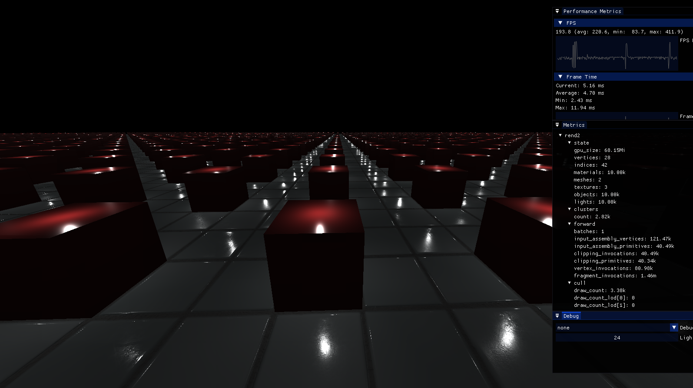

# Computer Graphics Renderer



This is a publication of the code discussed in https://logdahl.net/p/gpu-driven.
I have determined to publish it with a big warning! The code quality is a result
of loads of incremental adjustments, and also redundant features (the code is
based on a lab assignment I wrote for _Advanced Computer Graphics, 5DV179_ at Umeå University). I would not force
it onto my worst enemies. I believe there are some good ideas and good parts here.

It would be cool to clean this up in the future and continue building on it.
But for now, see it as just an implementation of a forward+ renderer with
culling and light clustering.

Likely only working on Linux (not due to the Vulkan code itself, but many other parts. sorry!).
To run:

```sh
cmake -B build
cmake --build build

./build/cgr scenes/manylights.xml
```

Take care :^)
